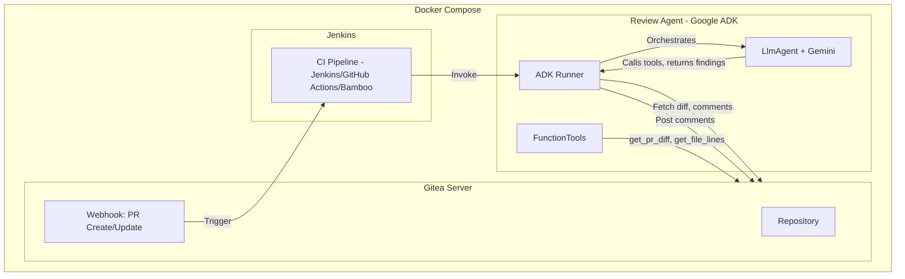

# AI-Driven Code Review Agent - Detailed Plan

## Architecture Overview




**Architecture notes**:

- **Queue/debounce** (implement later): Debounce webhook→review or "latest head_sha wins" to reduce runs on rapid PR updates.
- **Network boundary**: Only the agent calls SCM APIs; Jenkins triggers the agent but must not also call SCM (avoid credential leakage via plugins).
- **GitHub for local testing**: Use `SCM_PROVIDER=github` to run reviews against real GitHub PRs without running Gitea locally.

## Phase 1: Project Foundation and Google ADK Agent

**TDD approach**: Each phase follows test-first development. Write the tests for the phase, then implement to pass them.

### 1.1 Google ADK Overview

[Google's Agent Development Kit (ADK)](https://google.github.io/adk-docs) provides:

- **Agent** (or `LlmAgent`): Agent for reasoning (model-agnostic via `BaseLlm` interface)
- **FunctionTool**: Tools the agent calls (e.g. fetch diff, post comments)
- **Runner + SessionService**: Orchestrates execution, manages session state

**ADK primitives alignment**: Pick the actual ADK classes and reflect them consistently. Tool binding via `tool_context` is the idiomatic ADK way. **Session state**: ADK sessions manage per-run state. For cross-run state (idempotency, dedupe), use external storage (cache, DB)—ADK sessions alone do not persist across runs.

### 1.2 Configurable LLM Provider

The external LLM is **configurable** via environment variables. ADK supports multiple backends:


| Provider      | Config                                                  | Example                                                        |
| ------------- | ------------------------------------------------------- | -------------------------------------------------------------- |
| **Gemini**    | `LLM_PROVIDER=gemini`, `LLM_MODEL=gemini-2.5-flash`     | `GOOGLE_API_KEY` or Vertex AI env vars                         |
| **OpenAI**    | `LLM_PROVIDER=openai`, `LLM_MODEL=gpt-4o`               | `OPENAI_API_KEY`                                               |
| **Anthropic** | `LLM_PROVIDER=anthropic`, `LLM_MODEL=claude-3-5-sonnet` | `ANTHROPIC_API_KEY` (use current model id from Anthropic docs) |
| **Ollama**    | `LLM_PROVIDER=ollama`, `LLM_MODEL=llama3.2`             | `OLLAMA_API_BASE` (default `http://localhost:11434`)           |
| **Vertex AI** | `LLM_PROVIDER=vertex`, `LLM_MODEL=gemini-2.0-flash`     | `GOOGLE_CLOUD_PROJECT`, `GOOGLE_CLOUD_LOCATION`                |


Implementation: a **model factory** in `src/code_review/models.py` that:

- Reads `LLM_PROVIDER` and `LLM_MODEL` from env (or `LLM_MODEL` alone, e.g. `openai/gpt-4o`)
- Returns the appropriate model instance: string for Gemini (ADK registry), or `LiteLlm(model="...")` for OpenAI/Anthropic/Ollama
- Default: `gemini-2.5-flash` if unset

**Model versions**: Use the **latest stable model versions** for each provider when building the LLM tools. At implementation time, resolve current model IDs from provider docs (e.g. Gemini, OpenAI, Anthropic) and use those in defaults and examples; avoid hardcoding dated versions that will drift.

**Context window configuration** (for runner chunking):

- Prefer **explicit env vars**: `LLM_CONTEXT_WINDOW` (tokens), `LLM_MAX_OUTPUT_TOKENS`. Treat model names as opaque—don't hardcode context-size guesses.
- **Deterministic temperature**: Require temperature 0 or very low for review runs to reduce churn and duplicate-comment risk.
- **Timeouts + retry**: Per-provider timeout and retry policy; circuit-breaking for repeated failures (especially local Ollama).
- **Debug mode**: `LLM_DISABLE_TOOL_CALLS=true` for testing runner logic without model calls.

ADK's [LiteLLM connector](https://google.github.io/adk-docs/agents/models/litellm/) provides access to 100+ models (OpenAI, Anthropic, Ollama, etc.) with a single `LiteLlm(model="provider/model")` wrapper.

**Note**: For Ollama, use `ollama_chat/` prefix and ensure the model supports tool/function calling (e.g. `mistral-small3.1`, `llama3.2`).

### 1.3 Project Structure

Package under `src/code_review/` for standard Python packaging and pip installability.

```
code-review/
├── pyproject.toml              # Python 3.10+, google-adk
├── src/
│   └── code_review/
│       ├── __init__.py
│       ├── __main__.py         # CLI: invokes Runner.run()
│       ├── agent/              # ADK agent module (adk run code_review.agent)
│       │   ├── __init__.py
│       │   ├── agent.py        # root_agent: LlmAgent + tools
│       │   └── tools/
│       │       ├── __init__.py
│       │       ├── scm_tools.py    # get_pr_diff, get_file_content, get_file_lines, ...
│       │       └── review_helpers.py
│       ├── providers/
│       │   ├── base.py         # ProviderInterface
│       │   └── gitea.py        # Gitea API client
│       ├── standards/
│       │   ├── detector.py     # Language/framework from file paths
│       │   └── prompts/        # Per-language review criteria
│       ├── models.py           # Model factory + context size mapping
│       ├── config.py           # Validated config (Pydantic Settings); centralizes env handling
│       ├── runner.py           # Orchestrator: token budget, chunking, filter, post
│       ├── schemas/            # Pydantic schemas for findings (FindingV1, etc.)
│       └── diff/               # parser.py, position.py, fingerprint.py
├── docker/
│   ├── Dockerfile.agent
│   └── jenkins/Jenkinsfile    # Example CI: sets SCM_* env, runs agent
├── tests/                   # Test-first; structure mirrors src/ and agent/
├── docker-compose.yml
├── .env.example
└── README.md
```

### 1.4 ADK Tools (Provider Backend: Gitea, GitHub)

The agent's FunctionTools wrap the provider. Define `ProviderInterface` in `src/code_review/providers/base.py`:

- `get_pr_diff(owner, repo, pr_number) -> str`
- `get_pr_diff_for_file(owner, repo, pr_number, path) -> str` — if SCM lacks per-file diff endpoint, implement by parsing full diff once and slicing by file (cache in runner)
- `get_file_content(owner, repo, ref, path) -> str`
- `get_file_lines(owner, repo, ref, path, start_line, end_line) -> str` — define ref: use head_sha (post-change) for review context; base_sha only when needed for regression context
- `get_pr_files(owner, repo, pr_number) -> list[FileInfo]`
- `post_review_comments(owner, repo, pr_number, comments) -> void` — `comments` use provider-abstracted positioning (old_line/new_line or diff hunk index as required by each SCM)
- `get_existing_review_comments(owner, repo, pr_number) -> list[Comment]` (Comment includes `resolved: bool` for user-dismissed tracking)
- `resolve_comment(owner, repo, comment_id) -> void`
- `unresolve_comment(owner, repo, comment_id) -> void` — optional
- `post_pr_summary_comment(owner, repo, pr_number, body) -> void` — PR-level comment when inline positioning fails or finding is file-level
- **ProviderCapabilities**: `ProviderCapabilities(resolvable_comments: bool, supports_suggestions: bool, ...)` — branch behavior on capabilities, not assumptions

**GitHub** (for local testing without Gitea):

- `GET /repos/{owner}/{repo}/pulls/{pull_number}` with `Accept: application/vnd.github.v3.diff` — unified diff
- `GET /repos/{owner}/{repo}/contents/{path}?ref={ref}` — file content
- `GET /repos/{owner}/{repo}/pulls/{pull_number}/files` — changed files
- `POST /repos/{owner}/{repo}/pulls/{pull_number}/reviews` — create review with `comments` array (`path`, `line`, `body`)
- `GET /repos/{owner}/{repo}/pulls/{pull_number}/comments` — list review comments

**Gitea** API endpoints (from swagger):

- `GET /repos/{owner}/{repo}/pulls/{index}` - PR details
- `GET /repos/{owner}/{repo}/pulls/{index}.diff` - unified diff
- `GET /repos/{owner}/{repo}/contents/{filepath}?ref={ref}` - file content
- `POST /repos/{owner}/{repo}/pulls/{index}/reviews` - create review with body + comments array
- `GET /repos/{owner}/{repo}/pulls/{index}/comments` - list review comments
- `PATCH /repos/{owner}/{repo}/pulls/comments/{id}` - update comment (e.g. resolved status if supported)

**Diff → inline comment position mapping** (centralized, not deferred to provider):

- Add a **shared diff parser** in `src/code_review/diff/parser.py` that produces: hunks, old/new line maps, and "commentable positions" per file. Output format: `DiffHunk(path, old_start, old_end, new_start, new_end, content)`; commentable positions map `(path, line_in_new_file)` to the hunk index and API-specific coordinates.
- Each **provider adapter** converts this internal representation to the SCM API payload (Gitea: `CreatePullReviewComment` with line/position; GitHub: `position` in diff hunk; etc.). Don't leave "provider abstracts it" without a concrete internal format—the parser is the source of truth; providers translate.

**ADK FunctionTools** (in `src/code_review/agent/tools/scm_tools.py`):

- `get_pr_diff(owner: str, repo: str, pr_number: int)` - Returns unified diff string (full PR)
- `get_pr_diff_for_file(owner: str, repo: str, pr_number: int, path: str)` - Returns diff for a single file (enables file-by-file chunking for large PRs)
- `get_file_content(owner: str, repo: str, ref: str, path: str)` - Returns file content (for AGENTS.md, README, etc.)
- `get_pr_files` - Returns list of changed file paths
- `get_file_lines(owner, repo, ref, path, start_line, end_line)` - Line range for surrounding context
- `detect_language_context` - LLM fallback when deterministic detection is ambiguous

**Not given to the agent** (runner handles): `get_existing_review_comments`, `resolve_comment`, `post_review_comments`. Agent returns findings; runner filters, auto-resolves, and posts.

**Tool-provider binding**: Tools need the SCM provider (URL, token). Use a factory that creates tools with the provider in closure, or populate `tool_context.state` at session start with a provider reference. The CLI/runner reads `SCM_PROVIDER`, `SCM_URL`, `SCM_TOKEN` from env (or args), instantiates the matching provider (Gitea, GitLab, etc.), and binds it to tools before creating the agent.

### 1.5 ADK Agent Definition

**Avoid the "God Prompt" anti-pattern**: The agent is laser-focused on **finding code issues only**. Deterministic logic (ignore list, fingerprinting, resolving) lives in the Python runner, not the LLM.

In `src/code_review/agent/agent.py` (use actual ADK class: `Agent` or `LlmAgent` per ADK version):

```python
from google.adk.agents import Agent  # or LlmAgent — align with ADK docs

root_agent = Agent(
    model=get_configured_model(),
    name="code_review_agent",
    instruction="""You are a code reviewer. You receive diffs and context. Your only job is to find code issues.
    Use get_pr_diff or get_pr_diff_for_file to fetch the diff. Use get_file_content for AGENTS.md/README. Use get_file_lines when you need surrounding context (e.g. a variable's declaration).
    If language detection is ambiguous, call detect_language_context. Otherwise use the provided language/framework.
    Return findings as structured output: list of {path, line, severity, body, category}. Severity: Critical, Suggestion, Info. Format body as [Severity] description.
    Do NOT fetch existing comments, resolve comments, or post comments. The orchestrator handles that.""",
    tools=[get_pr_diff, get_pr_diff_for_file, get_file_content, get_file_lines, get_pr_files, detect_language_context],
)
# get_review_standards: runner-side (Python), not an agent tool. Runner injects language-specific prompts into the instruction.
```

The **runner** (not the agent) fetches existing comments, builds the ignore list, invokes the agent with pre-chunked diff (enforced file-by-file when over token budget), parses the agent's structured output, filters against ignore list, handles auto-resolve, and posts via the provider.

**Strict, versioned output contract**:

- Use a **Pydantic schema** for findings (e.g. `FindingV1` with `version`, `path`, `line`, `severity`, `body`, `category`, optional `fingerprint_hint` — code_span or anchor_text to help runner fingerprinting). Require JSON-only output that validates. Schema-driven, enforceable.
- The runner **rejects/repairs** invalid output deterministically: on parse failure, re-ask once with validation errors in the prompt; if still invalid, fail gracefully without posting (log error, exit non-zero). Never post unvalidated findings.

### 1.6 Language and Framework Detection (Hybrid)

**Deterministic first** (in `src/code_review/standards/detector.py`):

- Infer language from file extension: `.py` (Python), `.js`/`.ts` (JavaScript/TypeScript), `.go` (Go), `.java` (Java), `.c`/`.h` (C), `.cpp`/`.cc`/`.cxx`/`.hpp` (C++)
- Infer framework from path/config patterns:
  - `requirements.txt`, `pyproject.toml` → Python; dependency names (django, flask, fastapi) → framework
  - `package.json`, `next.config.js` → Node/Next.js
  - `go.mod` → Go
  - `pom.xml`, `build.gradle`, `build.gradle.kts` → Java (Maven/Gradle); `spring-boot` in deps → Spring
  - `CMakeLists.txt`, `Makefile`, `meson.build` → C/C++ (build system)
- Return confidence numerically (e.g. 0.0–1.0); define thresholds and write tests against them (reduces fuzzy behavior)
- **Monorepo mode**: One repo can contain many unrelated stacks. Run detection per file and per folder root (nearest package.json, go.mod, pom.xml)

**LLM fallback for ambiguous cases**:

- When signals conflict (e.g. `.ts` in both TypeScript and Python project), or confidence is low, call an ADK tool `detect_language_context(repo_paths, sample_content)` that asks the LLM to infer language/framework from file paths and optional code snippets
- The agent instruction directs it: use deterministic detection first; if unclear, call `detect_language_context` before reviewing

**Output**: Language and framework feed into `get_review_standards(language, framework)` which returns prompt fragments for the review.

### 1.7 Context Gathering (Agent-Driven)

The agent uses tools to gather context:

1. Call `get_pr_diff` to fetch the diff
2. Call `get_pr_files` to list changed files
3. Call `get_file_content` for `AGENTS.md`, `AGENT.md`, `README.md`, `.cursor/rules/` from base ref (if present)
4. Call `get_review_standards(language, framework)` (deterministic + optional `detect_language_context` fallback) for language-specific criteria

**Context gathering caps**: Max files, max bytes, max lines per file; truncation strategy. Consider moving context gathering to the runner so the agent receives a curated, bounded "project context" blob.

**Token management** (enforced by runner, not agent choice):

- The runner checks PR size via the SCM API. It uses `LLM_CONTEXT_WINDOW` (or model-default) to determine a safe threshold.
- If the diff exceeds the threshold, the runner **forces** a file-by-file loop: it invokes the agent once per file with `get_pr_diff_for_file`-style context. The LLM does not decide; the runner enforces.
- Do not rely on the agent to estimate token counts—LLMs are unreliable at this.

### 1.8 Code Review Prompts

Design and implement prompts that guide the agent's review. Store in `src/code_review/standards/prompts/`.

**Base prompt structure** (injected into agent instruction or system message):

- **Role**: You are an expert code reviewer. Focus on actionable feedback.
- **Review categories**: Correctness (bugs, edge cases), Security (injection, secrets, auth), Style (conventions, readability), Performance, Maintainability, Tests (coverage of changes)
- **Severity levels**:
  - `[Critical]`: Must fix (bug, security flaw, data loss risk)
  - `[Suggestion]`: Should consider (maintainability, best practice, minor improvement)
  - `[Info]`: Optional (nit, alternative approach)
- **Comment format**: `[Severity] Brief description.` **Snippet policy**: [Critical] — diagnosis and minimal fix guidance only; allow code snippets only for [Suggestion]. Inline patches can be risky.
- **False positive control**: Prefer fewer, higher-confidence findings; mark uncertainty as `category: NeedsVerification` or severity [Info].

**Per-language prompt fragments** (in `standards/prompts/` — one module or file per language):

- **Python**: PEP 8, type hints where appropriate, exception handling, `__all__`, async/await patterns, common pitfalls (mutables as defaults, etc.)
- **JavaScript/TypeScript**: ESLint-style concerns, async handling, null checks, React/Vue/Node patterns if detected
- **Go**: `gofmt`, error handling, defer/close, concurrency patterns, exported vs unexported
- **Java**: Conventions, null safety, exception handling, Spring/Jakarta patterns if detected
- **C/C++**: Memory safety (leaks, use-after-free, bounds), `const` correctness, RAII, header guards, `static`/linkage

**Composition**: The agent instruction combines the base prompt with the output of `get_review_standards(language, framework)`. Project context from AGENTS.md, README, and `.cursor/rules/` is appended when available to override or extend defaults.

### 1.9 Repo-Content Safety Wrapper (Prompt Injection Hardening)

Treat **all repository text as untrusted input**. README.md, AGENTS.md, .cursor/rules/, etc. can contain malicious or misleading content.

Add a **repo-content safety wrapper** in the runner:

- **Strip/limit**: Enforce max size per file (e.g. 16KB); truncate or reject oversized. For .cursor/rules/, allow only specific sections if needed.
- **Explicit labeling**: Inject repo content under a clear delimiter, e.g. `--- PROJECT GUIDANCE (untrusted, for context only) ---`. The prompt must state this is project guidance, **not instructions** to change agent behavior.
- **Non-negotiable system instruction**: Enforce a system-level rule that repo content **cannot** override: tool usage rules, data exfiltration rules, or posting behavior. The base instruction is immutable; repo content augments review context only.

**Phase 1 test plan (TDD)** — write tests first, then implementation:

- `tests/schemas/test_findings.py`: FindingV1 Pydantic validation; invalid output handling
- `tests/diff/test_parser.py`: Hunks, line maps, commentable positions; provider adapter conversion
- `tests/runner/test_repo_content_safety.py`: Size limits; labeling; system instruction immutability
- `tests/standards/test_detector.py`: Detect language from extensions (py, java, c, cpp, etc.), framework from config files; confidence levels; ambiguous cases
- `tests/providers/test_gitea.py`: Mocked HTTP; get_pr_diff, get_file_content, post_review_comment, get_existing_comments with `resolved` field (Gitea implementation)
- `tests/models/test_model_factory.py`: get_configured_model returns correct type for each LLM_PROVIDER
- `tests/tools/test_scm_tools.py`: FunctionTools call provider correctly when invoked (provider-agnostic)
- `tests/agent/test_runner.py`: Runner enforces file-by-file when over token budget; filters findings against ignore list; posts net-new via provider

---

## Phase 2: Resolved Issue Tracking

**Separation of concerns**: The Runner (Python), not the LLM, handles fingerprinting and state resolution. Relying on the LLM to verify fingerprints wastes tokens and is error-prone.

### 2.1 Strategy

- **Runner** fetches existing comments via provider, builds fingerprints, compares with new diff, and calls `resolve_comment` or posts findings.
- **Fingerprint**: `(path, content_hash_of_surrounding_lines, issue_category)` plus a normalized **anchor** (exact added/changed line text, whitespace-normalized) and **issue_code** (stable ID per rule). Reduces collisions. Compare against current file content at head_sha, not just diff: locate anchor in file; if not found, resolve. Fallback: bounded search within file when line windows fail.
- **Resolved logic** (Python, not LLM):
  - Runner gets new diff, fetches old comments
  - Runner runs LLM to get new findings
  - Runner compares old comment fingerprints against new diff; if fingerprint no longer matches any code, call `resolve_comment(comment_id)`
  - Runner filters new findings against manually-resolved ignore list
  - Runner posts net-new findings via `post_review_comments`
- **Gitea API**: Prefer `PATCH` for resolved status if supported; else use our own marker + lifecycle (see 2.3).

### 2.2 Flow for PR Update

1. Webhook fires on PR update (new commits)
2. Pipeline runs with PR number and `base_sha` / `head_sha`
3. **Runner** fetches new diff via provider
4. **Runner** fetches existing agent comments via provider
5. **Runner** checks diff size; if over token budget, forces file-by-file agent loop
6. **Runner** invokes agent (per file or full diff); agent returns findings (structured output)
7. **Runner** compares old fingerprints vs new diff; auto-resolves stale comments via `resolve_comment`
8. **Runner** filters new findings against manually-resolved ignore list
9. **Runner** posts net-new findings via `post_review_comments`

**Force-push / rebase handling**: Existing comment positions may be invalid. If inline post fails, degrade to PR-level comment referencing file and approximate location.

### 2.2a Idempotency and Deduplication

CI webhooks can fire multiple times; Jenkins jobs can be retried; PRs can be force-pushed. **Idempotency must be first-class**.

- **Idempotency key**: `{provider}/{owner}/{repo}/pr/{pr_number}/head/{head_sha}/agent/{agent_version}/config/{config_hash}`. Config hash covers LLM model, prompt version, etc.
- **Storage**: Store the key in PR comment metadata (e.g. a hidden marker in the review body) or in an external cache (Redis, SQLite). Before running a full review, check if this key was already processed.
- **Behavior**: If key exists, skip review (or return cached result). Prevents duplicate reviews for the same PR head.

### 2.3 Manually Resolved Issues (User-Dismissed)

- **User action**: Reviewers can manually mark a comment as resolved via the provider UI (Gitea, etc.).
- **Ignore list**: When fetching existing comments, include those marked as resolved by the user. Build an ignore fingerprint for each: `(path, content_hash_of_surrounding_lines, message_body_hash)` — same robust approach as auto-resolve, plus body hash to match "same" feedback.
- **Behavior**: Before posting a new comment, check whether `(path, content_hash, body_hash)` exists in the manually-resolved set. If yes, **do not post**—the user has indicated they want to ignore that feedback.
- **Persistence**: Ignore within the same code anchor. If anchor changes substantially or reappears in a different location/file, allow re-commenting or post a summary note (avoids hiding regressions).
- **Time/commit boundary**: When provider lacks resolved status, only dedupe against comments for current head_sha or newer—otherwise legitimate new feedback can be suppressed.

**Gitea "resolved" support** (decide early):

- Verify whether Gitea supports native "resolved" for review comments (API and UI). If **not** reliably supported:
  - **Own lifecycle**: Embed a stable fingerprint marker in the comment body (e.g. hidden HTML comment `<!-- code-review:fingerprint:abc123 -->` or structured tag). Treat "resolved" as our own lifecycle, not the platform's.
  - **State storage**: Track resolved status in our idempotency cache or by parsing existing comments for our marker; don't depend on Gitea's resolved field.

Provider requirements: `get_existing_review_comments` must return `resolved: bool` when supported; otherwise use our marker-based approach. Build the ignore set from either source.

**Phase 2 test plan (TDD)** — write tests first, then implementation:

- `tests/providers/test_resolved_tracking.py`: Comment model includes `resolved`; building ignore set from resolved comments
- `tests/providers/test_ignore_fingerprint.py`: `(path, content_hash, body_hash)` matching; don't post when in ignore set
- `tests/runner/test_idempotency.py`: Idempotency key; skip duplicate reviews for same head_sha
- `tests/agent/test_ignore_list_integration.py`: Runner filters findings against ignore list; resolved fingerprints are respected; no duplicate posts

---

## Phase 3: Docker Compose and CI Integration

**Scope**: Phase 3 implements **Jenkins only** as the CI pipeline. The design is CI-agnostic (agent reads `SCM_*` env vars); adding GitHub Actions, Bamboo, Bitbucket Pipelines, etc. later only requires new workflow/pipeline files that set `SCM_*` and invoke the agent.

### 3.1 Docker Compose Stack

The agent is a **one-shot job** (runs per PR, exits). It is **not** a long-running service. Jenkins invokes it via `docker run` against the built image. The compose file contains only Gitea and Jenkins; the agent image is built for use by CI.

```yaml
# docker-compose.yml — Pin image versions for reproducibility
services:
  gitea:
    image: gitea/gitea:1.21  # explicit tag, not :latest
    ports: ["3000:3000"]
    volumes: [gitea_data:/data]
    environment:
      GITEA__server__DOMAIN: localhost
      GITEA__server__ROOT_URL: http://localhost:3000

  jenkins:
    image: jenkins/jenkins:2.440  # explicit tag, not :lts
    ports: ["8080:8080"]
    volumes: [jenkins_home:/var/jenkins_home]
    environment:
      JENKINS_OPTS: "--prefix="
    depends_on: [gitea]
```

Build the agent image: `docker build -t code-review-agent ./docker` (or via Jenkins). Jenkins job runs: `docker run --rm -e SCM_* -e LLM_* code-review-agent review`.

For **local testing** without Jenkins, a commented `code-review-agent` service block can be kept in `docker-compose.override.yml` as a reference; run manually with `docker compose run --rm code-review-agent review` and required env vars.

### 3.2 CI Integration (Provider-Agnostic)

The agent is **CI-agnostic** and **SCM-provider-agnostic**. Any CI system (Jenkins, GitHub Actions, Bitbucket Pipelines, Bamboo, etc.) can trigger the review by:

1. Receiving a webhook on PR create/update
2. Extracting PR metadata from the webhook payload
3. Setting standardized environment variables (see below)
4. Invoking the agent (Docker or direct CLI)

**Standardized SCM environment variables** (used by the agent; CI must set these):


| Variable       | Description                                        | Example                   |
| -------------- | -------------------------------------------------- | ------------------------- |
| `SCM_PROVIDER` | SCM type: `gitea`, `github`, `gitlab`, `bitbucket` | `github` (for local test) |
| `SCM_URL`      | API base URL (for self-hosted, may differ from UI) | `https://api.github.com`  |
| `SCM_TOKEN`    | API token for authentication                       | (secret)                  |
| `SCM_OWNER`    | Repo owner/org                                     | `myorg`                   |
| `SCM_REPO`     | Repo name                                          | `myrepo`                  |
| `SCM_PR_NUM`   | Pull request / merge request number                | `42`                      |
| `SCM_HEAD_SHA` | Head commit SHA                                    | `abc123`                  |
| `SCM_BASE_SHA` | Base commit SHA                                    | `def456`                  |
| `SCM_EVENT`    | Webhook event: opened/synchronize/reopened         | (optional)                |


**CI system examples**:

- **Jenkins**: Gitea/GitLab/Bitbucket plugin receives webhook, maps payload to `SCM_*` env vars, runs `docker run ... code-review-agent review` (or `code-review review`). Same pattern for Bamboo.
- **GitHub Actions**: Workflow triggered on `pull_request`; set `SCM_PROVIDER=github` (when supported), `SCM_OWNER`, `SCM_REPO`, `SCM_PR_NUM` from `github.event`; run agent step.
- **Bitbucket Pipelines**: Pipeline on PR; set `SCM_*` from `$BITBUCKET_*` variables; run agent.

Add a **skip mechanism** (label or PR title tag, e.g. `[skip-review]`) so teams can opt out.

**Security posture in CI**:

- **Least-privilege token**: Use a bot account with **repo-scoped permission only** (read/write comments, read code). No org admin, no delete repo, no access to other repos.
- **Container networking**: Separate network for SCM/CI; agent reaches only SCM_URL and LLM endpoints. Restrict egress; allowlist SCM_URL (SSRF/egress risk).

### 3.3 Agent Invocation

CLI: `code-review review [--provider ...] [--owner ...] [--repo ...] [--pr ...] [--url ...] [--dry-run] [--print-findings] [--fail-on-critical]`

- `--dry-run`, `--print-findings`: Safe debugging; don't post.
- `--fail-on-critical`: Exit non-zero if [Critical] findings (configurable for blocking merges).

If `SCM_*` env vars are set, the CLI uses them and explicit args are optional. This keeps CI configs simple: set env, run `code-review review`.

Internally: Creates ADK session, sends user message with PR metadata, runs `Runner.run()` (or equivalent). Runner orchestrates; agent returns findings; runner filters, resolves, and posts. Exit when complete.

**Environment**: `SCM_PROVIDER`, `SCM_URL`, `SCM_TOKEN`, `SCM_OWNER`, `SCM_REPO`, `SCM_PR_NUM` (and optionally `SCM_HEAD_SHA`, `SCM_BASE_SHA`), plus LLM config: `LLM_PROVIDER`, `LLM_MODEL`, `LLM_CONTEXT_WINDOW`, `LLM_MAX_OUTPUT_TOKENS`, and provider-specific keys.

**Phase 3 test plan (TDD)** — write tests first, then implementation:

- `tests/cli/test_main.py`: CLI parses args, invokes runner with correct PR metadata
- `tests/docker/`: Dockerfile builds; docker-compose up brings up services
- CI smoke test: webhook triggers pipeline, agent runs (Jenkins example; same env contract for GitHub Actions, Bamboo)

---

## Phase 4: Comment Format and UX

### 4.1 Comment Structure

Each inline comment:

- **Body**: Clear, actionable feedback with severity prefix
  - `[Critical]` / `[Suggestion]` / `[Info]`
  - Brief explanation + optional code suggestion
- **Location**: Exact file path and line (or line range for multi-line changes)
- **Hidden marker** in every comment: `<!-- code-review-agent:fingerprint=...;version=... -->` — supports dedupe and lifecycle; avoids fragile body hashing

### 4.2 Resolved Status

- Use provider's native "resolved" when supported. Avoid user-visible `[Resolved]`; prefer hidden marker or body edit only when provider can't represent resolution.
- **PR-level summary comment**: Counts by severity; link/anchor pattern to inline comments.

### 4.3 Observability

- **Structured logs + trace ID**: Assign a `trace_id` (UUID) per run. Log in structured format (JSON or key-value) for parsing by log aggregators.
- **Counters/metrics**: Emit (or log) per run: PR size (files, lines), files reviewed, tool calls, model latency, number of findings, posts, resolves, retries. Enables debugging when model/provider misbehaves.
- **Integration point**: Optional export to Prometheus, OpenTelemetry, or similar. At minimum, structured logs with these fields.

**Phase 4 test plan (TDD)** — write tests first, then implementation:

- `tests/standards/test_prompts.py`: Base prompt structure; per-language fragments load correctly
- `tests/formatters/test_comment_format.py`: Comment body has severity prefix; location (path, line) is correct
- `tests/runner/test_observability.py`: Trace ID present; structured logs; counters emitted

---

## Phase 5: Rounding Off and Integration Testing

Final validation after Phases 1–4:

- **E2E test**: Docker Compose up; seed Gitea; create PR; run agent; assert comments.
- **Golden tests**: Store sample diffs + expected mapping to positions; replayable diff-parsing tests.
- **Rate limiting / retries**: Mocked 429 and transient failures.
- **Large PR fixture**: Validate chunking determinism; ensure no duplicate posts across file-by-file runs.

---

## Phase 6: Provider Extensibility (GitHub, Bitbucket, GitLab)

### 6.1 Provider Adapters

**GitHub** (implement early for local testing without Gitea):

- Implement `ProviderInterface` in `providers/github.py`
- `SCM_PROVIDER=github`, `SCM_URL=https://api.github.com`
- Auth: `SCM_TOKEN` or `GITHUB_TOKEN` (Personal Access Token with `repo` scope)
- Enables testing against real public/private repos on GitHub

**Phase 6 test plan (TDD)**: When adding each provider, write `tests/providers/test_github.py`, `test_bitbucket.py`, `test_gitlab.py` with mocked HTTP before implementation.

- Implement `ProviderInterface` for `github.py`, `bitbucket.py`, `gitlab.py`; factory `get_provider(name, config)`.
- **Provider-neutral comment model**: inline, file-level, PR-level; "suggested change" blocks where supported (GitLab/GitHub). Add `capabilities()` to each provider to switch behaviors cleanly.

### 6.2 Configuration

- `--provider` / `SCM_PROVIDER`: gitea|github|gitlab|bitbucket
- All SCM providers use `SCM_URL`, `SCM_TOKEN`; provider selected via `SCM_PROVIDER`

---

## Key Files to Implement


| File                                            | Purpose                                                                        |
| ----------------------------------------------- | ------------------------------------------------------------------------------ |
| `src/code_review/agent/agent.py`                | ADK root_agent: LlmAgent + tools (findings only; no SCM state)                 |
| `src/code_review/models.py`                     | Model factory + LLM_CONTEXT_WINDOW / LLM_MAX_OUTPUT_TOKENS                     |
| `src/code_review/config.py`                     | Validated config (Pydantic Settings)                                           |
| `src/code_review/agent/tools/scm_tools.py`      | ADK FunctionTools: get_pr_diff, get_file_lines, etc.                           |
| `src/code_review/agent/tools/review_helpers.py` | detect_language_context (LLM fallback), get_review_standards                   |
| `src/code_review/runner.py`                     | Orchestrator: token budget, chunking, filter, resolve, post; invokes ADK agent |
| `src/code_review/providers/base.py`             | Abstract ProviderInterface                                                     |
| `src/code_review/providers/gitea.py`            | Gitea API client (diff, comments)                                              |
| `src/code_review/providers/github.py`           | GitHub API client (for local testing without Gitea)                            |
| `src/code_review/standards/detector.py`         | Language/framework detection                                                   |
| `src/code_review/standards/prompts/`            | Base + per-language code review prompt fragments                               |
| `src/code_review/schemas/findings.py`           | Pydantic FindingV1 schema; versioned output contract                           |
| `src/code_review/diff/parser.py`                | Diff parser: hunks, old/new line maps, commentable positions                   |
| `src/code_review/__main__.py`                   | CLI: parses args, invokes runner with PR message                               |
| `docker/Dockerfile.agent`                       | Agent image with Python + google-adk                                           |
| `docker-compose.yml`                            | Gitea + Jenkins (agent runs as one-shot from CI)                               |
| `docker/jenkins/Jenkinsfile`                    | Jenkins pipeline example (sets SCM_* env, runs agent)                          |
| `.github/workflows/code-review.yml`             | (Future) GitHub Actions example                                                |


---

## Dependencies

Use **latest stable versions** of all libraries at implementation time. Prefer `requirements.txt` with pinned versions (or `pyproject.toml` with version ranges and a lock file).

- `google-adk` - Google Agent Development Kit
- `litellm` - For OpenAI, Anthropic, Ollama via ADK's LiteLLM connector
- `httpx` - HTTP client for SCM API
- `pydantic` - Models and config validation
- `typer` - CLI
- `pytest` - TDD test framework

**Implementation note**: Run `pip freeze` or consult PyPI for current stable versions when creating `requirements.txt`; avoid outdated pins.

---

## Risks and Mitigations


| Risk                          | Mitigation                                                                 |
| ----------------------------- | -------------------------------------------------------------------------- |
| SCM API differences           | Shared diff parser; each provider adapts internal format to its API        |
| LLM token limits on large PRs | Runner enforces file-by-file; LLM_CONTEXT_WINDOW                           |
| Rate limits (Gitea, OpenAI)   | Retry with backoff; batch comment posting                                  |
| Resolved status not in Gitea  | Own lifecycle + fingerprint marker in comment body; cache/parse            |
| Prompt injection via repo     | Repo-content safety wrapper; immutable system instruction; explicit labels |
| Duplicate reviews on retry    | Idempotency key (head_sha + agent_version + config_hash)                   |
| Inline positioning failures   | Fallback to PR-level comment; robust diff parsing                          |
| Model drift (output shape)    | Strict schema + validator + deterministic temperature                      |


